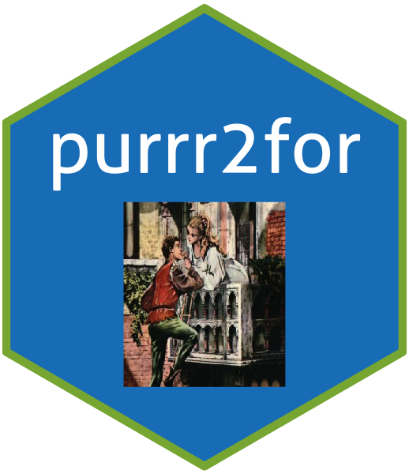

# purr2for



Concerned about R performance?

Automagically convert R/`purrr` syntax code blocks into efficient Julia `for` loops
with a simple Addin. No writing of Julia/RCpp code itself, the converter is feature-complete 
with both R's `purrr` and `*pply` family and writes the required Julia code.

## Installation

You can install the released version of purr2for from [GitHub](https://github.com/jonocarroll/purrr2for) with:

``` r
devtools::install_github("jonocarroll/purrr2for")
```

## Example

If you have a code block written in R (`purrr` or `*pply` loop)

``` r
map(1:10, function(x) x^2)
```

the Addin will convert this into a Julia call for you

``` Julia
map(x -> x^2, 1:10)
```

This can be wrapped in a [`JuliaCall`](https://cran.r-project.org/web/packages/JuliaCall/index.html) block and run inline.

## Benchmarks

``` r
Unit: microseconds
                              expr     min      lq      mean  median       uq      max neval cld
purrr::map(1:10, function(x) 10^2) 249.332 260.999 289.59205 265.926 286.9025 1474.852   100   b
       [Julia] map(x -> x^2, 1:10)  29.030  32.084  57.02304  36.705  38.8305 1917.149   100  a 
```
